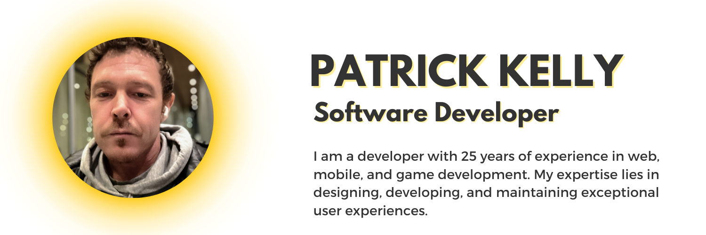

___
# Hi there, I'm Patrick Kelly 👋

>👨‍💻 Senior Software Engineer | Web & Cross-platform Development Specialist | Accessibility & SEO Advocate | Agile Methodology Champion | Mentor & Leader

---

## Follow me 

## Connect with me:

## 🚀 Featured Projects

> - **Globacore Interactive Technologies**: Led TypeScript development, CI/CD, automated testing, in-house tools, and React library creation. Improved product lifecycle and team skills.
> - **Canadian Tire Corporation**: Drove web experimentation, A/B testing, multivariate testing, and implemented code from Adobe XD to production.
> - **Butterfly Design**: Specialized in small business web solutions with a stack including HTML, CSS, JavaScript, React, Flutter, Next.js, and WordPress.
> - **Unreal Engine Project**: Developed an immersive VR experience utilizing Unreal Engine's powerful graphics and physics engine.
> - **Unity C# Game Development**: Crafted engaging game mechanics and interfaces for multiple indie game titles using Unity and C#.

---

## 🛠️ Tech Stack

### Languages & Frameworks:

### Tools & Technologies:

- Plus more...

---

## 🎓 Education

- **triOS College** - Video Game Design and Development (2016 - 2018), GPA: 3.8
- **Fanshawe College** - Diploma in Communication and Media Studies (2003 - 2005)
- **St. Lawrence College** - Diploma in Liberal Arts and Sciences/Liberal Studies

---

## 😄 Hobbies & Interests

> 🎸 Guitar | 🎧 EDM Production | 🎤 Hip Hop Lyrics | 🎮 Game Development | 💻 OSS Contributions | 📷 Photography | ✈️ Travel | 🐴 Horseback Riding

---

## 🚀 Community Involvement

> 🛰 Hosting discussions on UFO’s, Paranormal, Tech, and more.

> 🌐 Community organizer for XIAO - mentoring and tech learning.

---

